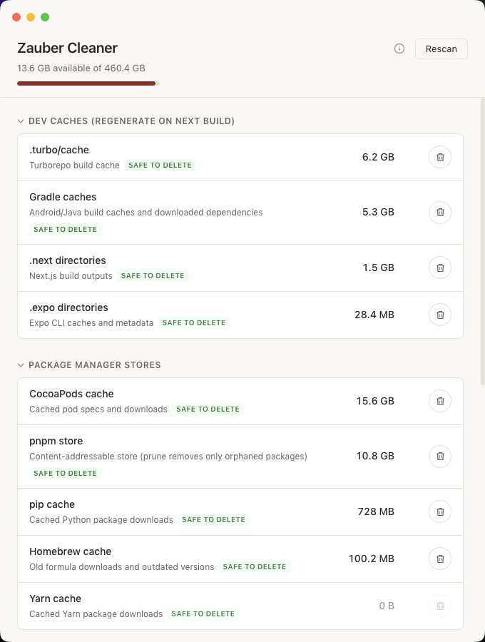

# Zauber Cleaner

A developer-focused Mac storage cleaner that finds and removes reclaimable disk space hiding in build caches, package stores, and dev tool artifacts.

> **Zauber** means *magic* in German — but it also sounds like **Sauber**, which means *clean*. A little magic to keep your Mac sauber.



## What it does

Scans your Mac for disk space consumed by developer tools and lets you review exactly what will be deleted before anything is removed. No surprises.

**14 cleanup categories across 6 groups:**

| Group | Categories |
|-------|-----------|
| Dev caches | `.next` directories, `.turbo/cache`, `.expo` directories, Gradle caches |
| Package managers | pnpm store, Yarn cache, CocoaPods cache, pip cache, Homebrew cache |
| Xcode / iOS | DerivedData, CoreSimulator (unavailable runtimes) |
| Docker | System prune (images, containers, build cache) |
| App leftovers | ShipIt installer caches, Playwright browsers |
| Trash | macOS Trash |

## How it works

1. **Scan** — each category runs a specific shell command to measure size. Items sorted by size, biggest first.
2. **Review** — click the trash icon to see individual folders with sizes and last-modified dates. Select which ones to delete.
3. **Delete** — only the items you selected are removed. A toast confirms how much space was freed.

Every row shows a safety badge:
- **Safe to delete** — regenerates on next build or install
- **Destructive** — permanent deletion, review carefully

## What it never touches

- Documents, Downloads, Desktop, or any user content
- Application data (`~/Library/Application Support`)
- System files or anything requiring sudo
- Source code or git repositories

## Install

### Download

Grab the latest `.dmg` from [Releases](https://github.com/TomNyein/ZauberCleaner/releases).

- **Apple Silicon** (M1/M2/M3/M4): `Zauber Cleaner-*-arm64.dmg`
- **Intel**: `Zauber Cleaner-*.dmg` (non-arm64)

Since the app isn't notarized, on first launch: right-click the app, click **Open**, then confirm.

### Build from source

```bash
git clone https://github.com/TomNyein/ZauberCleaner.git
cd ZauberCleaner
npm install
npm run dist
```

The `.app` will be in `release/mac-arm64/` (or `release/mac/` on Intel).

## Develop

```bash
npm run dev     # starts Vite + Electron with hot reload
npm run build   # production build (no packaging)
npm run dist    # build + package into .app and .dmg
```

## Tech stack

Electron + React + TypeScript. No native dependencies. Shell commands are hardcoded — user input never reaches the shell.

## Disclaimer

This tool deletes files from your system. Only use it if you understand what each category does. The author assumes no responsibility for data loss. Use at your own risk.

## Author

Made by [Tom Nyein](https://tomnyein.com)
